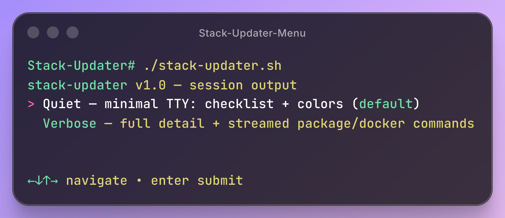
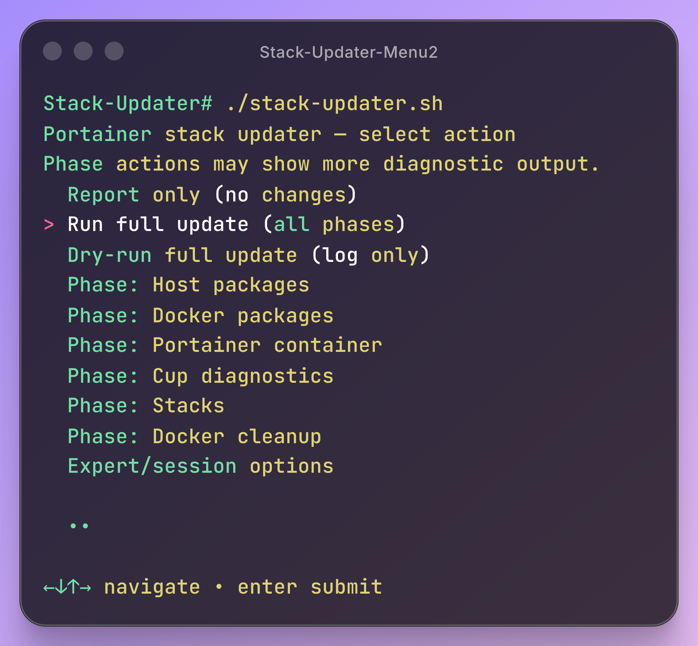

# Stack Updater

Stack Updater is a Bash utility for keeping Docker stacks updated while leaving **Portainer** in control.

I built it because updating containers one-by-one, or blindly redeploying everything, can get messy fast. Some stacks depend on others: VPN-backed services should wait for the VPN stack, and heavier apps often need extra time to settle. Stack Updater checks for available image updates, matches them to Portainer stacks, and redeploys them in a controlled order.

It does not run `docker compose` directly. Instead, it uses the **Portainer API** so Portainer remains the source of truth for stack management, while the script handles update checks, ordered redeploys, Portainer self-updates, Docker package updates, and cleanup of unused images, unused networks, and optionally unused volumes.

## Features

- Portainer API-based stack redeploys.
- Cup-based image update detection.
- Selective stack updates instead of blind full redeploys.
- Dependency-aware stack order.
- Optional Portainer CE self-update.
- Host and Docker package updates.
- Docker cleanup for unused images, networks, and optional volumes.
- Quiet dashboard output with detailed logs.
- Interactive Gum menu plus batch/cron-friendly CLI flags.

## Screenshots

### Interactive menu

<details>
<summary>Show menu options</summary>

<p align="center">
  
</p>

<p align="center">
  
</p>

</details>

### Quiet run

<details>
<summary>Show quiet run screenshot</summary>

<p align="center">
  
</p>

</details>

### Verbose run

<details>
<summary>Show verbose run screenshot</summary>

<p align="center">
  
</p>

</details>

## Default run

With the default config, a full run:

1. Checks the target Portainer endpoint.
2. Reads Cup update data if Cup is enabled.
3. Updates host packages and Docker-related packages.
4. Checks and updates the Portainer CE container if needed.
5. Redeploys only stacks with matching image updates.
6. Preserves dependency, dependent, heavy, and remaining stack order.
7. Cleans up unused Docker images and unused networks.
8. Leaves Docker volume pruning disabled unless explicitly enabled.
9. Prints a quiet summary and writes detailed logs.

Interactive TTY runs open the menu by default.

Non-TTY runs, such as cron, run the full pipeline automatically.

Use `--batch --yes` to run the full pipeline without opening the menu from an interactive shell.

## How it works

Stack Updater uses:

- **[Portainer](https://www.portainer.io/)** API for stack discovery and redeploys.
- **[Cup](https://github.com/sergi0g/cup)** for container update detection.
- **[Docker](https://docs.docker.com/)** image IDs for safe Portainer container update checks.
- **[Nala](https://github.com/volitank/nala)** for host package updates when available.
- **[Gum](https://github.com/charmbracelet/gum)** for the interactive menu.

Portainer remains the source of truth for your stacks.

## Requirements

Tested for Debian/Ubuntu-style hosts.

Required on the host:

- `bash`
- `curl`
- `jq`
- `docker`
- Portainer CE
- Portainer API key
- Portainer endpoint ID

Installed by `install-deps.sh`:

- `curl`
- `jq`
- `ca-certificates`
- `gnupg`
- `nala`
- `gum`

Docker and Portainer are **not** installed by this project.

## Quick start

Install helper dependencies:

```bash
chmod +x install-deps.sh
./install-deps.sh
```

Create your config:

```bash
cp config.env.example config.env
chmod 600 config.env
```

Edit the required values:

```bash
PORTAINER_URL="https://127.0.0.1:9443"
PORTAINER_API_KEY="your-api-key"
ENDPOINT_ID="1"

CUP_ENABLED="true"
CUP_URL="http://127.0.0.1:8000"
```

Set stack groups as needed:

```bash
DEPENDENCY_STACKS=(
  "gluetun"
)

DEPENDENT_STACKS=(
  "qbittorrent"
  "speedtest-tracker-vpn"
)

HEAVY_STACKS=(
  "immich"
  "frigate"
  "openwebui"
)

EXCLUDED_STACKS=(
  "legacy-stack"
  "manual-only-service"
)
```

Make the script executable and run a read-only check:

```bash
chmod +x stack-updater.sh
./stack-updater.sh --self-test
```

Run it:

```bash
./stack-updater.sh
```

## Menu and usage

Running without arguments in a TTY opens a minimal interactive menu:

1. Choose quiet or verbose output.
2. Choose confirmation behavior.
3. Pick an action.

Advanced session-only options are available from the expert menu.

Common commands:

```bash
# Full update without menu
./stack-updater.sh --batch --yes

# Dry run
./stack-updater.sh --batch --dry-run

# Report only
./stack-updater.sh --check-only

# Verbose full update
./stack-updater.sh --batch --yes --output verbose

# Skip the menu from a TTY
STACK_UPDATER_MENU=false ./stack-updater.sh
```

Run one phase:

```bash
./stack-updater.sh --phase host
./stack-updater.sh --phase docker_pkgs
./stack-updater.sh --phase portainer
./stack-updater.sh --phase cup
./stack-updater.sh --phase stacks
./stack-updater.sh --phase cleanup
```

Useful phase tests:

```bash
./stack-updater.sh --phase cup
./stack-updater.sh --phase portainer --dry-run
./stack-updater.sh --phase stacks --dry-run
./stack-updater.sh --phase cleanup --dry-run
```

Phase runs may show more diagnostic output than the normal quiet dashboard.

## Portainer updates

Set the Portainer release stream in `config.env`:

```bash
PORTAINER_RELEASE_STREAM="lts"
```

Supported values:

```bash
PORTAINER_RELEASE_STREAM="lts"
PORTAINER_RELEASE_STREAM="sts"
PORTAINER_RELEASE_STREAM="custom"
```

For custom images:

```bash
PORTAINER_RELEASE_STREAM="custom"
PORTAINER_IMAGE="portainer/portainer-ce:2.39.1"
```

The script pulls the configured image, compares the running container image ID with the local image ID, and recreates Portainer only when needed.

Portainer data is preserved through the `portainer_data` volume.

## Cup integration

Cup is optional but recommended.

```bash
CUP_ENABLED="true"
CUP_URL="http://127.0.0.1:8000"
CUP_REFRESH_BEFORE_CHECK="true"
CUP_REFRESH_TIMEOUT_SECONDS="60"
PORTAINER_USE_CUP_PRECHECK="true"
```

The script uses Cup to:

- Show tracked image counts.
- Detect available updates.
- Match outdated images to Portainer stacks.
- Skip unnecessary Portainer image pulls when Cup says Portainer is current.

Check Cup manually:

```bash
curl -s http://127.0.0.1:8000/api/v3/json | jq '.metrics'
```

## Cleanup

Default cleanup behavior:

```bash
PRUNE_UNUSED_IMAGES="true"
PRUNE_UNUSED_NETWORKS="true"
PRUNE_UNUSED_VOLUMES="false"
```

Volume pruning is disabled by default because unused Docker volumes can still contain important app data.

Enable it only when you are sure:

```bash
PRUNE_VOLUMES=1 ./stack-updater.sh --phase cleanup
```

## Logs

Default log path:

```text
./stack-updater.log
```

Set a custom path in `config.env`:

```bash
LOG_FILE="/opt/scripts/Stack-Updater/stack-updater.log"
```

Quiet mode keeps terminal output clean. Verbose mode and the log file keep the details.

## Safety notes

- Keep `config.env` private.
- Do not commit API keys.
- Back up Portainer before major Portainer updates.
- Keep volume pruning disabled unless you intentionally want it.
- Test with `--dry-run` before changing stack groups or update settings.

## Troubleshooting

Check config syntax:

```bash
bash -n config.env
```

Run the read-only self-test:

```bash
./stack-updater.sh --self-test
```

Check Cup:

```bash
./stack-updater.sh --phase cup
```

Check logs:

```bash
tail -150 stack-updater.log
```

Run a verbose dry run:

```bash
./stack-updater.sh --batch --dry-run --output verbose
```

